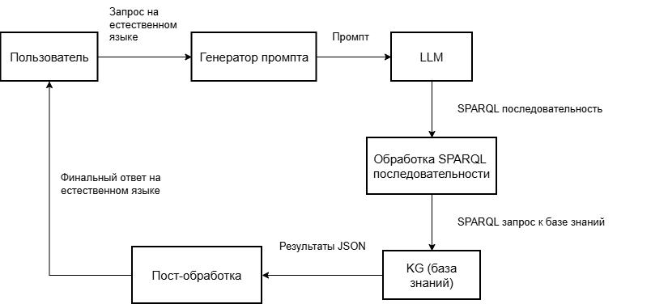

# LLM as a text2SPARQL converter

The problem of automatic generation of answers to complex scientific-metric questions to knowledge bases, asked in natural language, is considered. The relevance of the study is due to the limitations of modern large language models (LLM), which, despite a high degree of "understanding" of questions, tend to generate inaccurate answers and do not always have relevant information in specialized subject areas. At the same time, knowledge graphs ensure the accuracy and relevance of information but require knowledge of formal query languages. This paper proposes a solution based on a hybrid architecture in which LLM acts as an intelligent interface to an ontological knowledge base, transforming natural language questions into correct SPARQL queries, the results of which are returned to the user. To solve this problem, a specialized data corpus was compiled for training and testing NL-to-SPARQL models in the field of control theory. The approach is implemented based on an ontology of scientific activity in the field of control theory and tested on the generated corpus of questions. Integration of LLM with the ontological knowledge base allowed us to achieve high accuracy of answers (about 99%), which confirms the prospects of the proposed approach.

Retraining a modern LLM can require significant computational resources, so it seems appropriate to use Parameter-Efficient Fine-Tuning (PEFT) methods, which reduce the hardware requirements for computation. In particular, the Low-Rank Adapter (LoRA) and Quantized Low-Rank Adapter (QLoRA) methods seem reasonable. QLoRA, compared to LoRA, allows for even lower memory consumption, which is important for very large models. These methods allow additional training layers to be added to a pretrained model, each with a smaller number of parameters than the original model. The added layers are functionally separated into a separate block, called an adapter. Adapters are trained for a specific task without changing the weights of the original model. We trained and implemented the adapters on two A30 video cards with a total of 48 GB GPUs running OpenSUSE Leap 15.6.
In this work, we used a framework for integrating large language models with scientific ontologies based on graph databases. The system architecture is shown in Fig. 1. The main functional blocks of the system are the LLM block and the KG block (knowledge graph block). The system operates as follows. The user formulates a query for the system. Based on the query received, the system generates a prompt for the large language model. The prompt is then converted into a SPARQL sequence using the large language model. When processing the SPARQL sequence, excess code generated by the LLM is trimmed, service strings are commented, and prefixes for working with the database are added. Using the resulting SPARQL sequence, the desired information is extracted from the knowledge graph in JSON format and, after processing, returned to the user.

figure 1.

**Papper**: D.A. Gubanov and V.A. Sergeev INTEGRATION OF ONTOLOGIES AND LARGE LANGUAGE MODELS TO ANSWER SCIENTOMETRICS QUESTIONS USING CONTROL THEORY (in progress)
